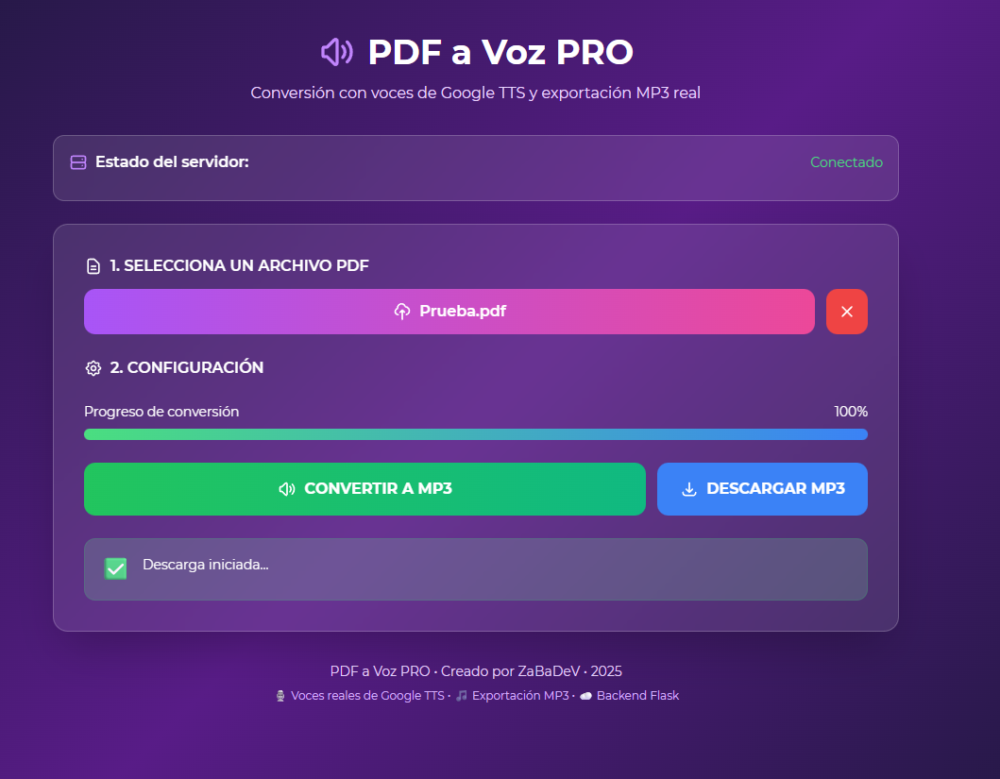

# PDF a Voz PRO 🎙️



**PDF a Voz PRO** convierte tus PDFs a MP3 usando voces reales de Google TTS. Es rápido, sencillo y pensado para producción con un flujo asíncrono que evita timeouts en peticiones largas.

---

## 🚀 ¿Qué hace?

- Convierte PDFs a MP3 con distintas voces/idiomas
- Cola de trabajos en background (procesamiento asíncrono)
- Progreso en la interfaz y descarga directa cuando termina
- Validaciones (tamaño máximo, timeouts) y logging para facilitar debugging

---

## 🧰 Requisitos

- Python 3.8+
- `pip` y `venv`

---

## 🏁 Inicio rápido (local)

```bash
git clone https://github.com/tu-usuario/pdf-voz-server.git
cd pdf-voz-server
python -m venv .venv
# Windows:
.\.venv\Scripts\activate
# Unix/macOS:
source .venv/bin/activate
pip install -r requirements.txt
python app.py
# Abre: http://localhost:5000
```

> Nota: La UI por defecto intenta conectar a `https://pdf-voz-server.onrender.com`. Para pruebas locales puedes abrir `http://localhost:5000`.

---

## ⚙️ Despliegue en Render (recomendado)

1. Sube tu repo a GitHub y crea un nuevo **Web Service** en Render.
2. Asegúrate de que el `Procfile` esté en la raíz (ejemplo recomendado):

```
web: gunicorn wsgi:app --timeout 120 --workers 2 --worker-class gthread --threads 4 --log-file -
```

3. Variables de entorno útiles:
- `ENABLE_DEBUG_JOBS=1` (activar temporalmente para inspeccionar trabajos)
- `DEBUG_JOBS_SECRET` (secreto para proteger el endpoint de debug)
- `FLASK_DEBUG=0` (recomendado en producción)

4. Despliega y revisa **Live Logs** para comprobar el procesamiento de jobs.

---

## 🔒 Seguridad y buenas prácticas

- No dejes `ENABLE_DEBUG_JOBS` activado sin protección; añade `DEBUG_JOBS_SECRET` y úsalo con cabeceras al consultar `/api/debug/jobs`.
- En producción desactiva el modo debug (`FLASK_DEBUG=0`) para evitar respuestas HTML con stack traces.
- Para mayor escalabilidad y persistencia, integra Redis + RQ/Celery para la cola de trabajos.

---

## 🐞 Troubleshooting

- `WORKER TIMEOUT` / 502: aumenta timeout en Gunicorn o usa un worker de background; la app ya usa jobs asíncronos.
- `ERR_BLOCKED_BY_CLIENT` en `/api/status`: extensiones (adblock); prueba en incógnito o con `curl`.
- Si un `job` devuelve 404 o error, revisa los logs en Render y usa `/api/debug/jobs` si tienes `ENABLE_DEBUG_JOBS=1`.

---

## 🤝 Contribuir

¡Contribuciones bienvenidas! Abre un issue para proponer cambios grandes o abre un PR con tus modificaciones.

---

## 📜 Licencia

MIT

---

¿Quieres que cree automáticamente un **pull request** con este README actualizado y la imagen `Captura.png` incluida, o prefieres que lo suba directamente al `main`? Dime cómo quieres proceder y lo hago por ti. ¡Quedó muy chulo! 🎉
